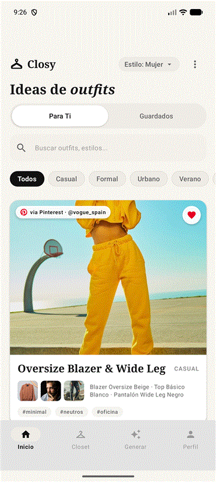

<div style="text-align: center;">

# Closy - Tu Estilo, Organizado

[](https://android.com)
[](https://kotlinlang.org)
[](https://developer.android.com/jetpack/compose)
[](https://m3.material.io)
[](https://developer.android.com/training/data-storage/room)
[](https://developer.android.com)

<p style="text-align: center;">
  <b>Una experiencia digital elegante, intuitiva y personalizada para organizar tu guardarropa, gestionar tu closet virtual y descubrir combinaciones y outfits únicos inspirados en tu estilo personal.</b>
</p>

[Visión General](#acerca-de-closy) •
[Capturas y Flujo](#capturas-de-pantalla-y-flujo-de-la-aplicación) •
[Características](#características-principales) •
[Stack Tecnológico](#stack-tecnológico-y-arquitectura) •
[Instalación](#requisitos-del-sistema-e-instalación) •
[Estructura](#estructura-del-proyecto)

---

</div>

## Acerca de Closy

**Closy** es una aplicación móvil nativa para Android diseñada para revolucionar la forma en que interactúas con tu ropa diaria. Inspirada en la estética minimalista y moderna de plataformas de inspiración como Pinterest, **Closy** ayuda a los usuarios a organizar su closet virtual, explorar outfits sugeridos, generar combinaciones inteligentes de prendas y guardar sus conjuntos favoritos de forma completamente independiente y segura.

### Visión del Proyecto
- **Personalización Inteligente y Adaptativa**: Configuración de preferencias de estilo mediante tarjetas ampliadas e imágenes miniatura descriptivas, sincronizando el género seleccionado con los avatares y algoritmos de recomendación.
- **Closet Virtual y Persistencia Total**: Gestión estructurada de prendas almacenadas en **Room Database** (`ClosetGarmentEntity`), con precarga automática para la cuenta de demostración (`jose@gmail.com`) y estado limpio por defecto en cuentas nuevas o de invitado.
- **Generador Inteligente de Combinaciones**: Pestaña dedicada para generar conjuntos de ropa basados en filtros de estilo y ocasión (Casual, Urbano, Formal, Verano, Fiesta, Cita, Trabajo), indicando en tiempo real las prendas del closet que coinciden.
- **Aislamiento de Sesión y Purga de Datos**: Autenticación persistente en Room DB con validaciones estrictas de correo (RFC), límites de longitud y sanitización, junto a una purga automática de datos de invitado al cerrar sesión (`purgeGuestData()`).
- **Control de Perfil y Modo Oscuro**: Panel de perfil con contadores dinámicos en tiempo real ("Prendas en Closet", "Outfits Guardados"), gestión global de tema oscuro (`ThemeRepository`) e intercepción inteligente del botón de retroceso (`BackHandler`).

---

## Capturas de Pantalla y Flujo de la Aplicación

A continuación se detalla el flujo principal de la aplicación con la estructura visual de sus pantallas clave y demostraciones animadas:

### Demostraciones Animadas (GIFs)

| Flujo de Autenticación y Personalización | Flujo de Feed Principal y Detalle |
| :---: | :---: |
| <br/><sub>**Autenticación & Selección de Estilo**<br/>Conmutación de pestañas, ingreso como invitado y personalización de experiencia.</sub> | <br/><sub>**Feed Interactivo & Ficha de Outfit**<br/>Filtrado dinámico por categorías y desglose de prendas en ModalBottomSheet.</sub> |

### Flujo de Experiencia de Usuario (Capturas Reales)

| 1. Autenticación | 2. Personalización de Estilo |
| :---: | :---: |
| <br/><sub>**Iniciar Sesión / Crear Cuenta**<br/>Pestañas segmentadas con soporte para inicio con Google y persistencia de sesión local.</sub> | <br/><sub>**Personaliza tu Experiencia**<br/>Selección interactiva de género (Hombre, Mujer, Sin género) con tarjetas ampliadas e imágenes miniatura.</sub> |

| 3. Feed de Outfits (Para Ti) | 4. Outfits Guardados & Filtros |
| :---: | :---: |
| <br/><sub>**Recomendaciones Estilo Pinterest**<br/>Navegación tipo "Para Ti" vs "Favoritos", animación horizontal, chips de filtros y confirmación de eliminación.</sub> | <br/><sub>**Guardados Aislados por Usuario**<br/>Vista de outfits marcados como favoritos vinculados de forma exclusiva al usuario activo.</sub> |

| 5. Ficha de Prendas (Bottom Sheet) | 6. Notificaciones Flotantes Ovaladas |
| :---: | :---: |
| <br/><sub>**Detalle de Outfits e Integración con Pinterest**<br/>Hoja modal inferior (`ModalBottomSheet`) con desglose de ropa y botón directo a Pinterest.</sub> | <br/><sub>**Top Floating Notification**<br/>Banner flotante superior en forma de píldora ovalada con desvanecimiento automático a los 2 segundos.</sub> |

> [!NOTE]
> *Las capturas de pantalla reales están ubicadas en `docs/screenshots/` y las demostraciones animadas en `docs/gifs/`.*

---

## Características Principales

### 1. Autenticación con Persistencia y Validaciones Estrictas (`Room DB`)
- Control de sesión completo con pestañas segmentadas (**Iniciar Sesión** y **Crear Cuenta**) respaldadas por la tabla `users` (`UserEntity`) en Room Database.
- Validaciones estrictas de formularios: expresión regular estándar RFC para correo electrónico, límite máximo de 50 caracteres por campo, comprobación de coincidencia de contraseñas y sanitización de entrada de texto.
- Cierre de sesión seguro con limpieza automática de datos en sesión de invitado mediante la función `purgeGuestData()`, evitando la contaminación de estado entre sesiones.

### 2. Notificaciones Flotantes Superiores Ovaladas (`TopFloatingNotification`)
- Componente de notificación flotante superior tipo píldora (`CircleShape`), con fondo oscuro (`#111111`) y texto en blanco para alta legibilidad.
- Animación fluida de entrada y salida vertical combinada con desvanecimiento (`slideInVertically` + `fadeIn`).
- **Temporizador de ocultamiento automático** configurado a **2 segundos** de inactividad para garantizar una experiencia limpia y no intrusiva.

### 3. Personalización Inicial de Estilo con Interfaz Enriquecida
- Pantalla de bienvenida y configuración inicial de preferencias con tarjetas ampliadas e imágenes miniatura descriptivas.
- Sincronización instantánea del género seleccionado con la foto de perfil del usuario y los filtros del feed de recomendaciones.

### 4. Feed de Recomendaciones "Para Ti" vs "Favoritos"
- Transiciones animadas horizontales al conmutar entre las pestañas **"Para Ti"** y **"Favoritos"**.
- Filtrado estricto de outfits por preferencia de género (Hombre, Mujer, Sin género) y por etiquetas de estilo.
- Diálogo modal de confirmación al desmarcar un conjunto favorito (`"¿Eliminar outfit de favoritos?"`), protegiendo al usuario ante acciones no intencionadas.

### 5. Closet Virtual Persistente (`ClosetGarmentEntity`)
- Registro y gestión de ropa respaldados por la tabla `closet_garments` (`ClosetGarmentEntity`) en **Room DB**, asociada al email del usuario activo (`userEmail`).
- Conjunto de ítems pre-cargados automáticamente para la cuenta de prueba `jose@gmail.com` y estado completamente vacío por defecto en cuentas nuevas e invitados.
- Visualización de prendas mediante tarjetas limpias sin íconos flotantes distractores.
- Formulario de registro simplificado con encabezado destacado **COLOR**, sin campos manuales de URL ni estilo, permitiendo la selección rápida mediante chips interactivos.

### 6. Pestaña "Generar Combinación" Basada en Filtros de Estilo y Ocasión
- Herramienta inteligente para generar combinaciones de prendas a partir de etiquetas de estilo y ocasión: **Casual**, **Urbano**, **Formal**, **Verano**, **Fiesta**, **Cita** y **Trabajo**.
- Indicador dinámico de estado en tiempo real que reporta la cantidad exacta de ropa disponible: `"X prendas de tu closet coinciden"`.

### 7. Pestaña Perfil con Contadores Dinámicos y Control de Sesión
- Panel de perfil con contadores dinámicos actualizados en tiempo real: **"Prendas en Closet"** y **"Outfits Guardados"**.
- Imágenes de avatar de género completamente sincronizadas.
- Botón de cierre de sesión con estilo destacado en rojo adaptado expresamente para el modo oscuro.
- Manejo del botón físico o gestual de retroceso mediante `BackHandler` con cuadro de diálogo de confirmación (`"¿Cerrar sesión?"`).

### 8. Persistencia Global de Modo Oscuro (`ThemeRepository`) e Ícono Adaptativo Centrado
- Gestión centralizada del tema visual mediante `ThemeRepository`, conservando la preferencia de Modo Oscuro o Claro a través de los cierres de la aplicación.
- Ícono de aplicación adaptativo centrado (`ic_closy_launcher`) optimizado para Material You y las directrices visuales de Android 13+.

### 9. Suite de Pruebas Unitarias Completa (71 Pruebas con 100% de Aprobación)
- Cobertura integral con **71 pruebas unitarias** que verifican el correcto funcionamiento de repositorios (`AuthRepository`, `ClosetRepository`, `OutfitRepository`, `ThemeRepository`) y ViewModels (`AuthViewModel`, `HomeViewModel`, `PersonalizationViewModel`).
- 100% de tasa de aprobación en la suite de pruebas automatizadas.

---

## Stack Tecnológico y Arquitectura

Closy está desarrollado siguiendo la arquitectura recomendada por Google (MVVM + Clean Architecture) y las mejores prácticas nativas de Android:

```
┌──────────────────────────────────────────────────────────────────────────┐
│                           UI Layer (Compose)                             │
│  AuthScreen │ PersonalizationScreen │ HomeScreen (Feed/Closet/Gen/Perfil)  │
└────────────────────────────────────┬─────────────────────────────────────┘
                                     │ StateFlow / UI Events
┌────────────────────────────────────▼─────────────────────────────────────┐
│                            ViewModel Layer                               │
│      AuthViewModel │ PersonalizationViewModel │ HomeViewModel                │
└────────────────────────────────────┬─────────────────────────────────────┘
                                     │ Coroutines / StateFlow
┌────────────────────────────────────▼─────────────────────────────────────┐
│                            Repository Layer                              │
│ AuthRepository │ OutfitRepository │ ClosetRepository │ ThemeRepository   │
└────────────────────────────────────┬─────────────────────────────────────┘
                                     │ DAOs
┌────────────────────────────────────▼─────────────────────────────────────┐
│                      Data Layer (Room Local DB)                          │
│ ClosyDatabase │ UserDao │ SavedOutfitDao │ ClosetGarmentDao │ ClosetItemDao │
└──────────────────────────────────────────────────────────────────────────┘
```

| Componente | Tecnología / Librería | Descripción |
| :--- | :--- | :--- |
| **Lenguaje** | [Kotlin 2.x](https://kotlinlang.org) | Lenguaje moderno y conciso para desarrollo nativo en Android. |
| **Interfaz de Usuario** | [Jetpack Compose](https://developer.android.com/jetpack/compose) + [Material 3](https://m3.material.io) | UI declarativa nativa con componentes expresivos M3 y soporte Edge-to-Edge. |
| **Navegación** | [androidx.navigation3](https://developer.android.com/guide/navigation) | Navegación basada en estados con `NavDisplay` y `@Serializable NavKey`. |
| **Arquitectura** | MVVM + Clean Architecture | Separación clara de responsabilidades entre UI, lógica de negocio y capas de datos. |
| **Persistencia Local** | [Room DB](https://developer.android.com/training/data-storage/room) | Base de datos SQLite reactiva con entidades `UserEntity`, `SavedOutfitEntity` y `ClosetGarmentEntity`. |
| **Gestión de Tema** | `ThemeRepository` | Repositorio dedicado a la persistencia del estado de tema claro/oscuro. |
| **Asincronía** | Kotlin Coroutines & `StateFlow` | Manejo eficiente de tareas en segundo plano y emisión reactiva de estado UI. |
| **Carga de Imágenes** | [Coil](https://coil-kt.github.io/coil/) (`coil-compose`) | Carga asíncrona de imágenes locales y recursos remotos. |
| **Procesador de Anotaciones** | Google KSP | Procesamiento de anotaciones en tiempo de compilación para Room. |

---

## Requisitos del Sistema e Instalación

### Requisitos Previos
- **Android Studio**: Ladybug (2024.2.1) o superior.
- **JDK**: Java Development Kit 17.
- **Android SDK**:
  - Minimum SDK: `24` (Android 7.0 Nougat).
  - Target SDK: `35` (Android 15).

### Pasos de Instalación y Ejecución

1. **Clonar el repositorio**:
   ```bash
   git clone https://github.com/tu-usuario/closy.git
   cd closy
   ```

2. **Abrir en Android Studio**:
   Abre Android Studio y selecciona **Open**, luego navega hasta la carpeta del proyecto.

3. **Compilar el proyecto**:
   Puedes compilar el proyecto ejecutando el siguiente comando Gradle en la terminal:
   ```bash
   ./gradlew assembleDebug
   ```

4. **Ejecutar Pruebas Unitarias**:
   Para ejecutar las 71 pruebas unitarias del proyecto y verificar el 100% de aprobación:
   ```bash
   ./gradlew testDebugUnitTest
   ```

5. **Desplegar en Emulador o Dispositivo Físico**:
   Conecta un dispositivo con Depuración USB habilitada (o inicia un emulador AVD) y presiona **Run** (`Shift + F10`).

---

## Estructura del Proyecto

El código fuente de Closy está organizado de manera modular por capas y características dentro del paquete `com.closy`:

```
closy/
├── app/
│   ├── src/
│   │   ├── main/
│   │   │   ├── java/com/closy/
│   │   │   │   ├── ClosyApplication.kt          # Clase de aplicación principal
│   │   │   │   ├── MainActivity.kt              # Activity principal con Edge-to-Edge y BackHandler
│   │   │   │   ├── data/                        # Capa de datos
│   │   │   │   │   ├── db/                      # Base de datos Room
│   │   │   │   │   │   ├── ClosyDatabase.kt     # Definición de la BD SQLite y migraciones
│   │   │   │   │   │   ├── UserEntity.kt        # Tabla de usuarios
│   │   │   │   │   │   ├── UserDao.kt           # DAO de usuarios
│   │   │   │   │   │   ├── SavedOutfitEntity.kt # Tabla de outfits guardados por usuario
│   │   │   │   │   │   ├── SavedOutfitDao.kt    # DAO de outfits guardados
│   │   │   │   │   │   ├── ClosetGarmentEntity.kt # Tabla de prendas del closet virtual
│   │   │   │   │   │   ├── ClosetGarmentDao.kt  # DAO de prendas del closet virtual
│   │   │   │   │   │   ├── ClosetItemEntity.kt  # Tabla legacy de items del closet
│   │   │   │   │   │   └── ClosetItemDao.kt     # DAO legacy de items del closet
│   │   │   │   │   ├── model/                   # Modelos de dominio (Outfit, GarmentItem, User, UserPreferences)
│   │   │   │   │   └── repository/              # Repositorios (AuthRepository, OutfitRepository, ClosetRepository, ThemeRepository)
│   │   │   │   ├── navigation/                  # Navegación con Navigation 3
│   │   │   │   │   └── AppNavigation.kt         # Rutas NavKey y NavDisplay
│   │   │   │   └── ui/                          # Capa de presentación (Jetpack Compose)
│   │   │   │       ├── auth/                    # Pantalla de Login y Registro (AuthScreen, AuthViewModel)
│   │   │   │       ├── personalization/         # Selección de preferencias (PersonalizationScreen, PersonalizationViewModel)
│   │   │   │       ├── home/                    # Pantalla principal (HomeScreen, HomeViewModel)
│   │   │   │       ├── components/              # Componentes UI reutilizables (Notificación Ovalada, Chips, Tarjetas)
│   │   │   │       └── theme/                   # Sistema de diseño (Color.kt, Type.kt, Theme.kt, Shape.kt)
│   │   │   └── res/                             # Recursos (ic_closy_launcher, Drawables, Mipmaps, Values)
│   │   └── test/                                # 71 Pruebas unitarias de repositorios y ViewModels
│   └── build.gradle.kts
├── build.gradle.kts
├── gradle/
│   └── libs.versions.toml                       # Gradle Version Catalog
└── README.md
```

---

<div style="text-align: center;">

Desarrollado usando **Kotlin** y **Jetpack Compose**.

</div>
