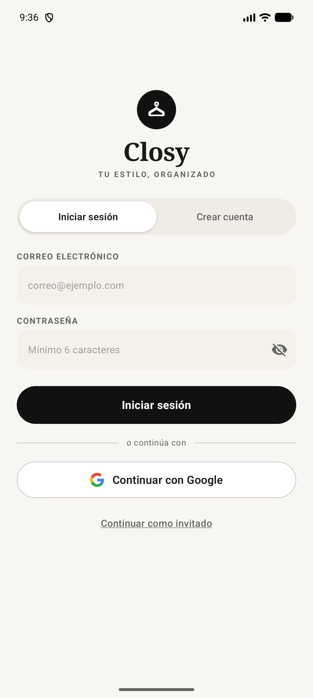
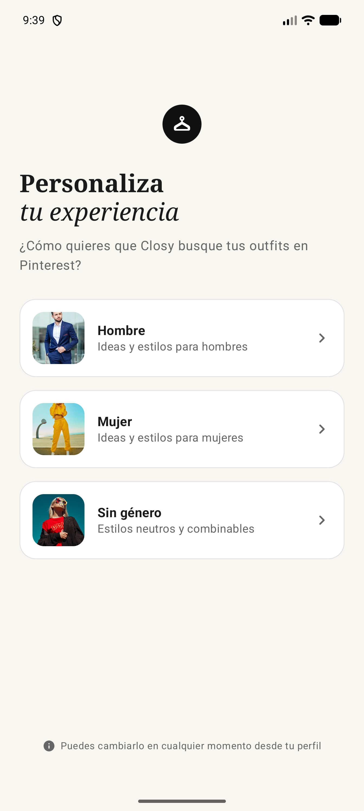
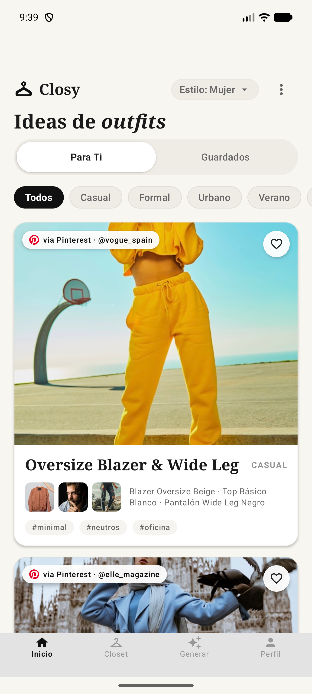
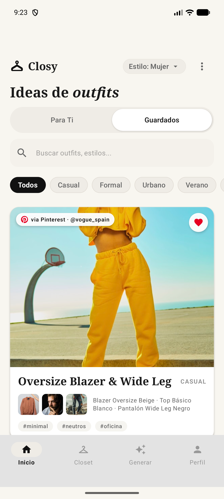
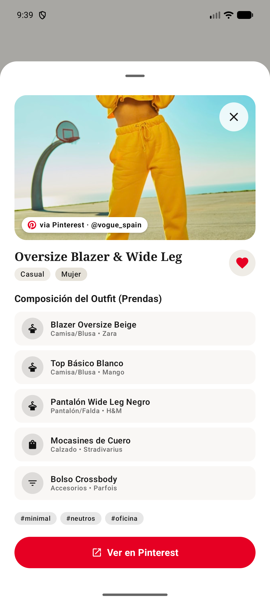
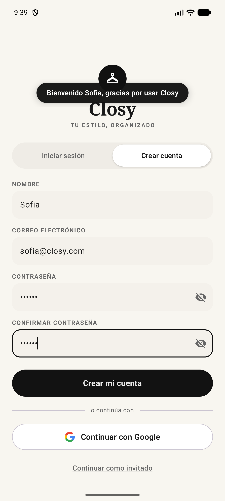

<div align="center">

# Closy - Tu Estilo, Organizado

[](https://android.com)
[](https://kotlinlang.org)
[](https://developer.android.com/jetpack/compose)
[](https://m3.material.io)
[](https://developer.android.com/training/data-storage/room)
[](https://developer.android.com)

<p align="center">
  <b>Una experiencia digital elegante, intuitiva y personalizada para organizar tu guardarropa y descubrir outfits únicos inspirados en tu estilo personal.</b>
</p>

[Visión General](#-acerca-de-closy) •
[Capturas y Flujo](#-capturas-de-pantalla-y-flujo-de-la-aplicación) •
[Características](#-características-principales) •
[Stack Tecnológico](#-stack-tecnológico-y-arquitectura) •
[Instalación](#-requisitos-del-sistema-e-instalación) •
[Estructura](#-estructura-del-proyecto)

---

</div>

## Acerca de Closy

**Closy** es una aplicación móvil nativa para Android diseñada para revolucionar la forma en que interactúas con tu ropa diaria. Inspirada en la estética minimalista y moderna de plataformas de inspiración como Pinterest, **Closy** ayuda a los usuarios a explorar outfits sugeridos, clasificar estilos por preferencias individuales (Hombre, Mujer, Sin género) y guardar sus conjuntos favoritos de forma completamente independiente y segura.

### Visión del Proyecto
- **Personalización Inteligente**: Adaptación continua del feed de recomendaciones según las preferencias de estilo seleccionadas por cada usuario (casual, formal, urbano, deportivo, etc.).
- **Organización e Independencia**: Aislamiento estricto de datos entre cuentas mediante persistencia local segura con **Room Database**.
- **Diseño Expressive & Moderno**: Paleta cálida beige (`#F8F6F0`), superficies refinadas, tipografía mixta Serif/Sans y botones con contraste equilibrado.
- **Inspiración y Compra**: Conexión directa entre las prendas del outfit y búsquedas temáticas en **Pinterest**.

---

## Capturas de Pantalla y Flujo de la Aplicación

A continuación se detalla el flujo principal de la aplicación con la estructura visual de sus pantallas clave:

### Flujo de Experiencia de Usuario

| 1. Autenticación | 2. Personalización de Estilo |
| :---: | :---: |
| <br/><sub>**Iniciar Sesión / Crear Cuenta**<br/>Pestañas segmentadas con soporte para inicio con Google y persistencia de sesión local.</sub> | <br/><sub>**Personaliza tu Experiencia**<br/>Selección interactiva de género (Hombre, Mujer, Sin género) con íconos vectoriales dedicados.</sub> |

| 3. Feed de Outfits (Para Ti) | 4. Outfits Guardados & Filtros |
| :---: | :---: |
| <br/><sub>**Recomendaciones Estilo Pinterest**<br/>Navegación tipo "Para Ti" vs "Guardados", chips de filtros por categoría y tarjetas interactivas.</sub> | <br/><sub>**Guardados Aislados por Usuario**<br/>Vista de outfits marcados como favoritos vinculados de forma exclusiva al usuario activo.</sub> |

| 5. Ficha de Prendas (Bottom Sheet) | 6. Notificaciones Flotantes Ovaladas |
| :---: | :---: |
| <br/><sub>**Detalle de Outfits e Integración con Pinterest**<br/>Hoja modal inferior (`ModalBottomSheet`) con desglose de ropa y botón directo a Pinterest.</sub> | <br/><sub>**Top Floating Notification**<br/>Banner flotante superior en forma de píldora ovalada con desvanecimiento automático (2s).</sub> |

> [!NOTE]
> *Las capturas de pantalla están estructuradas para asociarse con las imágenes ubicadas en `docs/screenshots/`.*

---

## Características Principales

### 1. Autenticación con Persistencia Local (`Room DB`)
- Control de sesión completo con **Iniciar Sesión** y **Crear Cuenta** a través de un control de pestañas segmentado (`SegmentedTabControl`).
- Guardado seguro de credenciales e información de usuario en la tabla local `users` (`UserEntity`).
- Soporte para validación de campos, simulación de login social (Google) y cierre de sesión con limpieza de estado.

### 2. Notificaciones Flotantes Ovaladas (`TopFloatingNotification`)
- Mensajes informativos tipo banner flotante superior con forma de píldora/óvalo (`CircleShape`), fondo oscuro (`#111111`) y texto blanco.
- Animación fluida de entrada y salida vertical con desvanecimiento (`slideInVertically` + `fadeIn`).
- **Temporizador de desvanecimiento automático** a los **2 segundos** de inactividad para no interrumpir la navegación.

### 3. Feed Personalizado de Recomendaciones Estilo Pinterest
- Visualización de outfits en un layout dinámico inspirado en Pinterest.
- Cambio dinámico entre pestañas **"Para Ti"** y **"Guardados"**.
- Filtros por categoría (Casual, Formal, Deportivo, Streetwear, Noche, etc.) actualizables en tiempo real.
- Algoritmo de filtrado por preferencia de género seleccionada previamente por el usuario.

### 4. Aislamiento Estricto de Datos por Usuario
- La tabla de guardados `saved_outfits` (`SavedOutfitEntity`) utiliza una clave primaria compuesta por `(userEmail, outfitId)`.
- Garantiza que cada usuario registrado o autenticado tenga su propia lista de outfits favoritos privada, sin mezclar datos entre diferentes cuentas en el mismo dispositivo.

### 5. Desglose Detallado de Prendas e Integración con Pinterest
- Al pulsar en cualquier outfit, se despliega una hoja modal inferior (`ModalBottomSheet`).
- Muestra el listado individualizado de prendas (camisetas, pantalones, calzado, accesorios) con detalles de marca, categoría y color.
- Incluye botón directo **"Buscar en Pinterest"** que abre la app o el navegador web con la consulta exacta del conjunto para adquirir o guardar inspiración.

### 6. Tema Personalizado y Diseño Adaptativo
- Paleta cromática exclusiva basada en un fondo beige cálido (`#F8F6F0`), tarjetas blancas limpias y botones oscuros (`#111111`).
- Tipografía refinada combinando familias Serif (títulos) y Sans-Serif (cuerpo y etiquetas).
- Cumplimiento estricto con las directrices de **Edge-to-Edge** y **Material Design 3**.

---

## Stack Tecnológico y Arquitectura

Closy está desarrollado siguiendo las mejores prácticas de desarrollo nativo en Android y la arquitectura recomendada por Google:

```
┌─────────────────────────────────────────────────────────┐
│                    UI Layer (Compose)                   │
│      AuthScreen  │  PersonalizationScreen  │ HomeScreen  │
└───────────────────────────┬─────────────────────────────┘
                            │ StateFlow / UI Events
┌───────────────────────────▼─────────────────────────────┐
│                    ViewModel Layer                      │
│   AuthViewModel  │ PersonalizationViewModel │ HomeViewModel │
└───────────────────────────┬─────────────────────────────┘
                            │ Coroutines
┌───────────────────────────▼─────────────────────────────┐
│                    Repository Layer                     │
│          AuthRepository   │   OutfitRepository          │
└───────────────────────────┬─────────────────────────────┘
                            │ DAOs
┌───────────────────────────▼─────────────────────────────┐
│               Data Layer (Room Local DB)                │
│    ClosyDatabase  │  UserDao  │  SavedOutfitDao         │
└─────────────────────────────────────────────────────────┘
```

| Componente | Tecnología / Librería | Descripción |
| :--- | :--- | :--- |
| **Lenguaje** | [Kotlin 2.x](https://kotlinlang.org) | Lenguaje moderno, conciso y seguro para desarrollo Android. |
| **Interfaz de Usuario** | [Jetpack Compose](https://developer.android.com/jetpack/compose) + [Material 3](https://m3.material.io) | UI declarativa nativa con componentes expresivos M3. |
| **Navegación** | [androidx.navigation3](https://developer.android.com/guide/navigation) | Navegación basada en estados con `NavDisplay` y `@Serializable NavKey`. |
| **Arquitectura** | MVVM + Clean Architecture | Separación clara de responsabilidades entre UI, lógica y datos. |
| **Persistencia Local** | [Room DB](https://developer.android.com/training/data-storage/room) | Base de datos SQLite reactiva con entidades `UserEntity` y `SavedOutfitEntity`. |
| **Asincronía** | Kotlin Coroutines & `StateFlow` | Manejo de hilos en segundo plano y emisión reactiva de estados UI. |
| **Carga de Imágenes** | [Coil](https://coil-kt.github.io/coil/) (`coil-compose`) | Carga eficiente e interactiva de imágenes remotas y locales. |
| **Procesador de Anotaciones** | Google KSP | Procesamiento de anotaciones ultrarrápido para Room y Moshi. |

---

## Requisitos del Sistema e Instalación

### Requisitos Previos
- **Android Studio**: Ladybug (2024.2.1) o superior.
- **JDK**: Java Development Kit 17.
- **Android SDK**:
  - Minimum SDK: `24` (Android 7.0 Nougat).
  - Target SDK: `35` (Android 15).

### Pasos de Instalación y Ejecución

1. **Clonar el repositorio**:
   ```bash
   git clone https://github.com/tu-usuario/closy.git
   cd closy
   ```

2. **Abrir en Android Studio**:
   Abre Android Studio y selecciona **Open**, luego navega hasta la carpeta clonada del proyecto.

3. **Compilar el proyecto**:
   Puedes compilar el proyecto ejecutando el siguiente comando Gradle en la terminal:
   ```bash
   ./gradlew assembleDebug
   ```

4. **Ejecutar Pruebas Unitarias**:
   Para verificar las pruebas unitarias del proyecto:
   ```bash
   ./gradlew testDebugUnitTest
   ```

5. **Desplegar en Emulador o Dispositivo Físico**:
   Conecta un dispositivo con Depuración USB habilitada (o inicia un AVD) y presiona **Run** (`Shift + F10`).

---

## Estructura del Proyecto

El código fuente de Closy está organizado de manera modular por capas y características dentro del paquete `com.closy`:

```
closy/
├── app/
│   ├── src/
│   │   ├── main/
│   │   │   ├── java/com/closy/
│   │   │   │   ├── ClosyApplication.kt          # Clase de aplicación principal
│   │   │   │   ├── MainActivity.kt              # Activity principal con Edge-to-Edge
│   │   │   │   ├── data/                        # Capa de datos
│   │   │   │   │   ├── db/                      # Base de datos Room
│   │   │   │   │   │   ├── ClosyDatabase.kt     # Definición de la BD SQLite
│   │   │   │   │   │   ├── UserEntity.kt        # Tabla de usuarios
│   │   │   │   │   │   ├── UserDao.kt           # DAO de usuarios
│   │   │   │   │   │   ├── SavedOutfitEntity.kt # Tabla de outfits guardados por usuario
│   │   │   │   │   │   └── SavedOutfitDao.kt    # DAO de outfits guardados
│   │   │   │   │   ├── model/                   # Modelos de dominio (Outfit, GarmentItem, User)
│   │   │   │   │   └── repository/              # Repositorios (AuthRepository, OutfitRepository)
│   │   │   │   ├── navigation/                  # Navegación con Navigation 3
│   │   │   │   │   └── AppNavigation.kt         # Rutas NavKey y NavDisplay
│   │   │   │   └── ui/                          # Capa de presentación (Jetpack Compose)
│   │   │   │       ├── auth/                    # Pantalla de Login y Registro
│   │   │   │       │   ├── AuthScreen.kt
│   │   │   │       │   └── AuthViewModel.kt
│   │   │   │       ├── personalization/         # Selección de preferencias de estilo
│   │   │   │       │   ├── PersonalizationScreen.kt
│   │   │   │       │   └── PersonalizationViewModel.kt
│   │   │   │       ├── home/                    # Feed principal de outfits y guardados
│   │   │   │       │   ├── HomeScreen.kt
│   │   │   │       │   └── HomeViewModel.kt
│   │   │   │       ├── components/              # Componentes UI reutilizables (Notificación Ovalada, Píldoras, etc.)
│   │   │   │       └── theme/                   # Sistema de diseño (Color.kt, Type.kt, Theme.kt, Shape.kt)
│   │   │   └── res/                             # Recursos (Drawables, Mipmaps, Values, Vector Assets)
│   │   └── test/                                # Pruebas unitarias de repositorios y ViewModels
│   └── build.gradle.kts
├── build.gradle.kts
├── gradle/
│   └── libs.versions.toml                       # Gradle Version Catalog
└── README.md
```

---

<div align="center">

Desarrollado con ❤️ usando **Kotlin** y **Jetpack Compose**.

</div>
